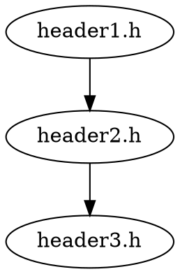

# NutHeaderTools

头文件处理工具集，用于分析和优化C++项目的头文件。

## 功能特性

- **头文件扫描**: 自动扫描项目中的所有头文件
- **依赖分析**: 分析头文件之间的依赖关系
- **问题检测**: 检测头文件中的常见问题（如缺少头文件保护）
- **依赖图生成**: 生成头文件依赖关系图
- **统计分析**: 提供详细的头文件统计信息

## 安装依赖

```bash
pip install -r Requirements.txt
```

## 使用方法

### 基本用法

```bash
# 扫描项目头文件
python Source/Programs/NutHeaderTools/HeaderTools.py scan --project-root /path/to/project

# 分析头文件依赖和问题
python Source/Programs/NutHeaderTools/HeaderTools.py analyze --project-root /path/to/project

# 验证头文件有效性
python Source/Programs/NutHeaderTools/HeaderTools.py validate --project-root /path/to/project

# 生成依赖关系图
python Source/Programs/NutHeaderTools/HeaderTools.py graph --project-root /path/to/project

# 只显示摘要信息
python Source/Programs/NutHeaderTools/HeaderTools.py analyze --summary
```

### 高级用法

```bash
# 导出分析结果到JSON文件
python Source/Programs/NutHeaderTools/HeaderTools.py analyze --output analysis.json

# 生成自定义名称的依赖图
python Source/Programs/NutHeaderTools/HeaderTools.py graph --output my_dependencies.dot
```

## 命令说明

### scan
扫描项目中的头文件，显示所有找到的 `.h` 和 `.hpp` 文件。

### analyze
运行完整的头文件分析，包括：
- 扫描头文件
- 分析依赖关系
- 检测问题
- 生成统计信息

### validate
验证头文件的有效性，检查：
- 头文件保护
- 包含文件数量
- 其他常见问题

### graph
生成头文件依赖关系图，输出为DOT格式，可以用Graphviz工具可视化。

### optimize
头文件优化功能（开发中），将包括：
- 移除未使用的include
- 重新排序include语句
- 优化头文件保护

## 输出格式

### 分析结果JSON格式

```json
{
  "headers": ["文件路径列表"],
  "dependencies": {
    "头文件路径": ["依赖的头文件列表"]
  },
  "issues": {
    "头文件路径": ["问题列表"]
  },
  "statistics": {
    "total_headers": 总头文件数,
    "total_dependencies": 总依赖数,
    "total_issues": 总问题数,
    "average_dependencies_per_header": 平均依赖数,
    "directory_statistics": {
      "目录名": {
        "count": 文件数,
        "issues": 问题数
      }
    }
  }
}
```

### 依赖图DOT格式



## 配置

可以通过修改 `HeaderProcessor.py` 中的配置来自定义行为：

- `include_paths`: 添加额外的包含路径
- `scan_directories`: 修改扫描的目录列表
- 验证规则：添加或修改头文件验证规则

## 扩展开发

### 添加新的分析功能

1. 在 `HeaderProcessor.py` 中添加新的方法
2. 在 `HeaderAnalyzer.py` 中集成新功能
3. 在 `HeaderTools.py` 中添加新的命令

### 自定义验证规则

在 `_validate_single_header` 方法中添加新的验证逻辑：

```python
def _validate_single_header(self, header_file: Path) -> List[str]:
    issues = []
    # 添加新的验证规则
    if some_condition:
        issues.append("新的问题描述")
    return issues
```

## 故障排除

### 常见问题

1. **找不到头文件**: 检查项目路径是否正确
2. **依赖解析失败**: 确保包含路径配置正确
3. **权限错误**: 确保脚本有执行权限

### 调试模式

可以通过修改代码添加调试输出来排查问题：

```python
import logging
logging.basicConfig(level=logging.DEBUG)
```

## 贡献

欢迎提交Issue和Pull Request来改进这个工具。

## 许可证

本项目采用MIT许可证。 